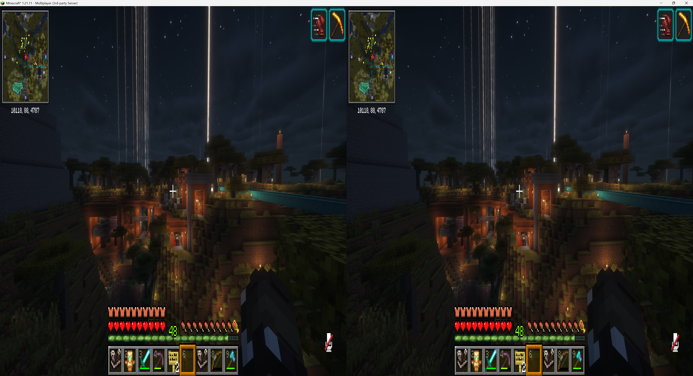

# StereoCraft: Stereoscopic 3D (Angelica edition)

Side-by-side (SBS) stereoscopic 3D rendering for Minecraft **1.7.10** on the [Angelica](https://github.com/GTNewHorizons/Angelica) renderer (GTNH's Iris/Sodium/Embeddium fork). Splits the Minecraft window into left and right eye views with a configurable interpupillary distance (IPD), producing a stereoscopic image for 3D TVs, 3D monitors, SBS-capable HMDs, and VR passthrough virtual monitors.

This is the 1.7.10 sibling of the [Fabric 1.21.11 StereoCraft mod](https://github.com/MitchellMarx/Stereoscopic) — same features, ported to Angelica's renderer and Forge 1.7.10.

## Requirements

- Minecraft **1.7.10**
- Forge **10.13.4.1614** or later
- Java **17** (via Angelica's `lwjgl3ify` + `jvmDowngrader` chain — same JVM GTNH uses)
- [Angelica](https://github.com/GTNewHorizons/Angelica) **`[2.1,2.2)`** (hard dependency — bundles Sodium, Embeddium, and Iris)
- [GTNHLib](https://github.com/GTNewHorizons/GTNHLib) **0.9.52** or later

## Optional

- A shaderpack loaded through Angelica's bundled Iris — tested against BSL and Complementary Reimagined / Unbound. DH (Distant Horizons) terrain alignment is supported under shaders.
- Reverse-SBS displays / VR passthrough virtual monitors — toggle **Swap eyes** in Sodium options.

## Installation

1. Install Forge 10.13.4.1614+ for Minecraft 1.7.10 (use a launcher that supports Java 17 — e.g. PrismLauncher with the GTNH meta).
2. Install [Angelica](https://github.com/GTNewHorizons/Angelica) `[2.1,2.2)` and [GTNHLib](https://github.com/GTNewHorizons/GTNHLib) `0.9.52+` into your `mods/` folder.
3. Grab `stereoscopic-vX.Y.Z.jar` from the [GitHub releases](../../releases) page and drop it into `mods/`.
4. Launch the game.

## Configuration

Open the in-game options menu and go to **Video Settings → Sodium → Stereoscopic** (added by our Sodium options-page integration). From there:

- **Mode** — `OFF`, `SBS_FULL`, `SBS_HALF`, `OUDA_FULL`, `OUDA_HALF`. Toggling triggers an Iris pipeline rebuild on the next frame, so the screen may flash briefly.
- **IPD (mm)** — interpupillary distance, 55–75 mm anthropomorphic range. Default 64 mm.
- **Convergence (blocks)** — off-axis convergence distance. Objects at this depth sit at the screen plane (zero parallax); closer pops out, farther recedes. 0 = parallel-axis (no shear, everything pops out). Default 4.
- **Swap eyes** — flip which eye-render goes to which physical eye. Toggle if depth looks inverted on your display.
- **HUD mode** — `DUPLICATE` (per-eye HUD), `STRETCH` (full-width across both eyes), or `HIDE`.
- **Debug: force eye** — render only LEFT or RIGHT eye full-screen, for debugging per-eye divergence.

Persistent settings live at `config/stereoscopic.cfg` (standard Forge config format). Manual edits round-trip cleanly through the in-game options page.

## Compatibility

- **Iris shaderpacks**: BSL, Complementary Reimagined, Complementary Unbound (all tested). Per-eye colortex banking keeps each eye's temporal slots (PBR reflection cache, TAA history, screen-space colored blocklight) separate so eyes don't cross-contaminate. DH-projection shear restoration keeps Distant Horizons terrain aligned with regular chunks under shaders.
- **Distant Horizons**: works under shaders (Iris's DH path is shear-corrected per eye) and without shaders.
- **Xaero's minimap**: minimap renders once per frame (gated by frame counter), not twice — won't double-draw under our two-pass renderWorld.
- **ChromaticTooltips**: tooltip overlay positions per eye.
- **HUDCaching** (Angelica feature): HUD caches at full resolution once per frame, then blit-duplicates per eye.

## Known limitations

- **Async cursor presents Windows-only**: the cursor-mirroring feature that keeps the OS cursor smooth at low FPS uses Win32 cursor APIs. On Linux/macOS the cursor will only appear in one eye while a screen (inventory, chat, options) is open.
- **NEI overlay**: works, but extra-large item tooltips may slightly clip at the eye-half boundary because NEI's overlay uses display-pixel coords.
- **Iris pipeline first-frame rebuild**: on world load, Iris loads its pipeline once before our stereo state is published. We auto-trigger a rebuild on the first stereo-active frame — you may see a one-frame flash.
- **Sodium chunk visibility cull**: BFS skipped on the second eye (chunks visible to one eye are visible to the other at typical IPD). At extreme IPD / convergence settings near a chunk boundary you might see a missing-chunk artifact for one frame.

## Screenshot

## License

LGPL-3.0-only. See [LICENSE](LICENSE).
